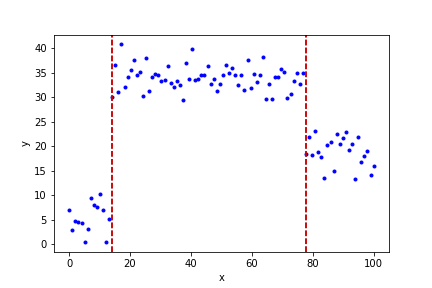
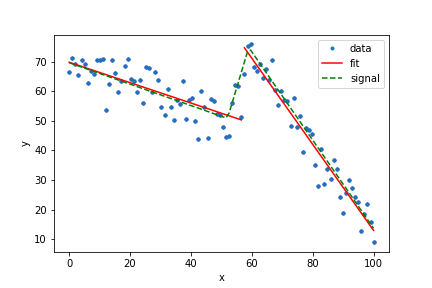
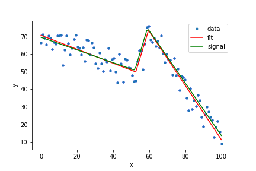

# Optimal Partitioning
Implementation of the OP algorithm for C++ and Python.

## functions:

op1D : OP for piece-wise constant signal

op2D : OP for piece-wise linear signals

op2D : OP for piece-wise continuous linear signals (with continuity constraint). This function does not find the optimal solution (in term of square error) but has the same complexity as OP and is optimized with the same pruning.

## clone the repo

This repo uses Pybind as a submodule. This requires attention when cloning. Please do:

    git clone --recursive git://github.com/mpascucci/optimalpartitioning 

## install Python
Execute one of the following commands in the base folder of the repo.

Install in the current python environment:

    pip install .

Create an importable python module in the package folder:

    pip install -e .
